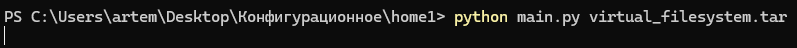
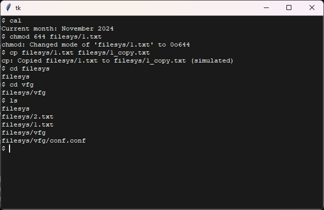
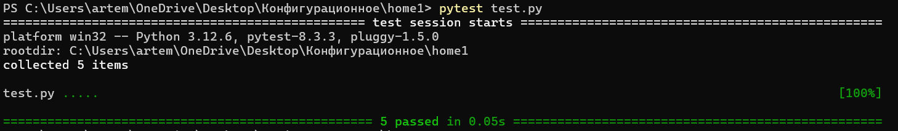

# Вариант № 17
## Задание № 1
### Условие
Разработать эмулятор для языка оболочки ОС. Необходимо сделать работу
эмулятора как можно более похожей на сеанс shell в UNIX-подобной ОС.
Эмулятор должен запускаться из реальной командной строки, а файл с
виртуальной файловой системой не нужно распаковывать у пользователя.
Эмулятор принимает образ виртуальной файловой системы в виде файла формата
tar. 

Эмулятор должен работать в режиме GUI
Конфигурационный файл имеет формат csv и содержит:
- Имя пользователя для показа в приглашении к вводу.
- Имя компьютера для показа в приглашении к вводу.
- Путь к архиву виртуальной файловой системы.
- Путь к лог-файлу.
- Путь к стартовому скрипту.
  
Лог-файл имеет формат json и содержит все действия во время последнего
сеанса работы с эмулятором. Для каждого действия указаны дата и время. Для
каждого действия указан пользователь.
Стартовый скрипт служит для начального выполнения заданного списка
команд из файла.
Необходимо поддержать в эмуляторе команды ls, cd и exit, а также
следующие команды:
1. cal.
2. chmod.
3. cp.

Все функции эмулятора должны быть покрыты тестами, а для каждой из
поддерживаемых команд необходимо написать 3 теста.

### Решение

Был разработан эмулятор терминала на python, поддерживающий необходимые команды.
Команды были покрыты тестами, которые были успешно пройдены.

Запуск программы с аргументом архива файловой системы

Работа эмулятора

### Тестирование

Успешное выполнение всех тестов

