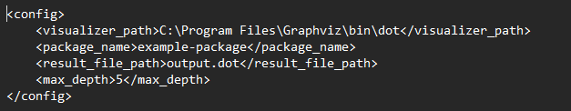
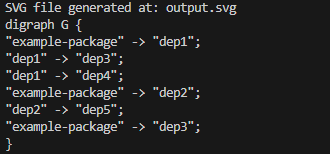
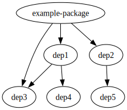

# Вариант № 17
## Задание №2
### Условие
Разработать инструмент командной строки для визуализации графа
зависимостей, включая транзитивные зависимости. Сторонние средства для
получения зависимостей использовать нельзя.

Зависимости определяются по имени пакета языка JavaScript (npm). Для
описания графа зависимостей используется представление Graphviz.
Визуализатор должен выводить результат на экран в виде кода.

Конфигурационный файл имеет формат xml и содержит:
- Путь к программе для визуализации графов.
- Имя анализируемого пакета.
- Путь к файлу-результату в виде кода.
- Максимальная глубина анализа зависимостей.
Все функции визуализатора зависимостей должны быть покрыты тестами.

### Решение

Был разработан инструмент командной строки для визуализации истроии коммитов в репозитории в конкретной ветке.
Для задания работы программы используется конфигурационный файл в формате xml.
Результат выполнения программы предтавляет собой код в формате dot и граф визуализации в формате svg.

Конфигурационный файл

### Тестирование

Программма успешно отработала для введённых конфигурационных значений. Отобразила dot код на экран и в файл.
Dot код был преобразован в формат svg.

Сгенерированный dot код

граф в формате svg

