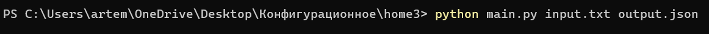
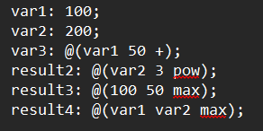
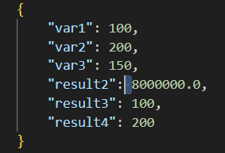

# Вариант № 17
## Задание №3
### Условие
Разработать инструмент командной строки для учебного конфигурационного языка, синтаксис которого приведен далее. Этот инструмент преобразует текст из входного формата в выходной. Синтаксические ошибки выявляются с выдачей сообщений.

Входной текст на учебном конфигурационном языке принимается из файла, путь к которому задан ключом командной строки. Выходной текст на языке json попадает в файл, путь к которому задан ключом командной строки.

Словари:

{

 имя : значение;
 
 имя : значение;
 
 имя : значение;
 
 ...
 
}

Имена:

[_a-zA-Z][_a-zA-Z0-9]*

Значения:

- Числа.
- Словари.

Объявление константы на этапе трансляции:
имя: значение
Вычисление константного выражения на этапе трансляции (постфиксная форма), пример:

@(имя 1 +)

Результатом вычисления константного выражения является значение.
Для константных вычислений определены операции и функции:
1. Сложение.
2. Вычитание.
3. Умножение.
4. pow().
5. max().

Все конструкции учебного конфигурационного языка (с учетом их возможной вложенности) должны быть покрыты тестами. Необходимо показать 3 примера описания конфигураций из разных предметных областей.

### Тестирование
Запуск программы с аргументом.

Исходный файл

Результат

Программа успешно прошла тестирование.
