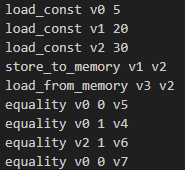
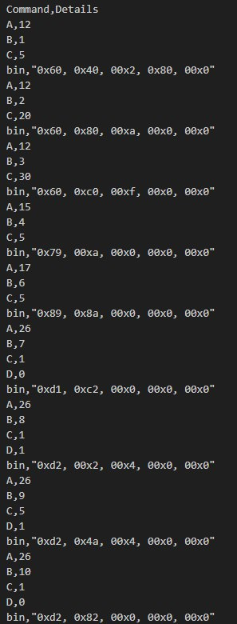
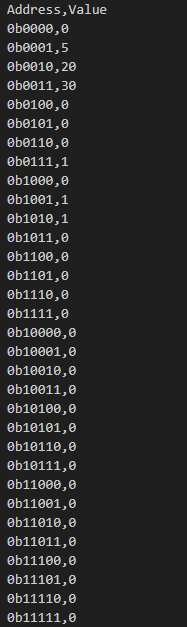

# Вариант № 17
## Задание №4
### Условие
Разработать ассемблер и интерпретатор для учебной виртуальной машины
(УВМ). Система команд УВМ представлена далее.

Для ассемблера необходимо разработать читаемое представление команд  УВМ. Ассемблер принимает на вход файл с текстом исходной программы, путь к которой задается из командной строки.
Результатом работы ассемблера является  бинарный файл в виде последовательности байт, путь к которому задается из  командной строки. Дополнительный ключ командной строки задает путь к файлу-  логу, в котором хранятся ассемблированные инструкции в духе списков  “ключ=значение”, как в приведенных далее тестах.

Интерпретатор принимает на вход бинарный файл, выполняет команды УВМ  и сохраняет в файле-результате значения из диапазона памяти УВМ. Диапазон  также указывается из командной строки.
Форматом для файла-лога и файла-результата является yaml.
Необходимо реализовать приведенные тесты для всех команд, а также  написать и отладить тестовую программу.

#### Загрузка константы

 | A        | B        | C         |
 |:---------|:---------|:----------|
 | Биты 0—4 | Биты 5—9 | Биты 10—25|
 | 12        | Адрес    | Константа |

Размер команды: 5 байт. Операнд: поле C. Результат: регистр по адресу, которым является поле B.

Тест (A=12, B=9, C=746):

0x2C, 0xA9, 0x0B, 0x00, 0x00

#### Чтение значения из памяти

| A        | B        | C         |
|:---------|:---------|:----------|
| Биты 0—4 | Биты 5—9 | Биты 10—14|
| 17        | Адрес    | Адрес     |

Размер команды: 5 байт. Операнд: значение в памяти по адресу, которым является регистр по адресу, которым является поле C. Результат: регистр по адресу, которым является поле B.

Тест (A=17, B=24, C=17):

0x11, 0x47, 0x00, 0x00, 0x00

#### Запись значения в память

| A        | B        | C         |
|:---------|:---------|:----------|
| Биты 0—4 | Биты 3—6 | Биты 7—11 |
| 15        | Адрес    | Адрес    | 

Размер команды: 5 байт. Операнд: регистр по адресу, которым является поле B. Результат: значение в памяти по адресу, которым является поле C.

Тест (A=15, B=7, C=136):

0xEF, 0x20, 0x02, 0x00, 0x00

#### Бинарная операция: ()

| A        | B        | C         | D          |
|:---------|:---------|:----------|:-----------|
| Биты 0—4 | Биты 5—9 | Биты 10—14 | Биты 15-21|
| 26        | Адрес    | Адрес   | Смещение      |

Размер команды: 5 байт. Первый операнд: регистр по адресу, которым является поле B. Второй операнд: значение в памяти по адресу, которым является сумма адреса (регистр по адресу, которым является поле C) и смещения (поле D).
Результат: регистр по адресу, которым является поле B.

Тест (A=26, B=30, C=1, D=26):

0xDA, 0x07, 0x0D, 0x00, 0x00

### Тестирование

Программа успешно прошла тестирование

Исходная программа

Логи ассемблера

Результат (Дамп памяти)

